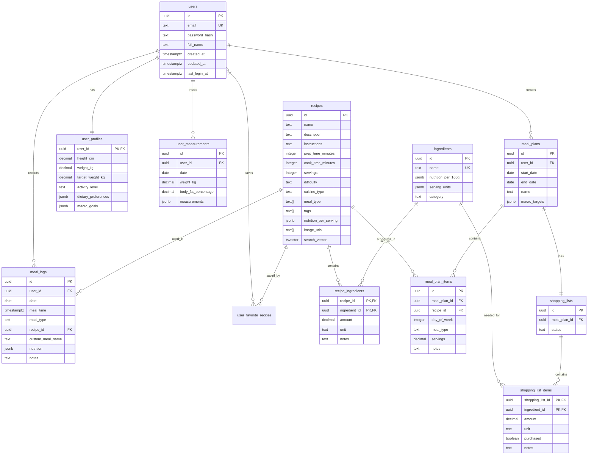

# Database Schema

```mermaid
erDiagram
    users ||--o{ meal_plans : creates
    users ||--|| user_profiles : has
    users ||--o{ user_measurements : tracks
    users ||--o{ meal_logs : records
    users }|--o{ user_favorite_recipes : saves
    
    recipes ||--o{ recipe_ingredients : contains
    recipes ||--o{ meal_plan_items : scheduled_in
    recipes ||--o{ user_favorite_recipes : saved_by
    recipes ||--o{ meal_logs : used_in
    
    ingredients ||--o{ recipe_ingredients : used_in
    ingredients ||--o{ shopping_list_items : needed_for
    
    meal_plans ||--o{ meal_plan_items : contains
    meal_plans ||--|| shopping_lists : has
    shopping_lists ||--o{ shopping_list_items : contains

    users {
        uuid id PK
        text email UK
        text password_hash
        text full_name
        timestamptz created_at
        timestamptz updated_at
        timestamptz last_login_at
    }

    user_profiles {
        uuid user_id PK,FK
        decimal height_cm
        decimal weight_kg
        decimal target_weight_kg
        text activity_level
        jsonb dietary_preferences
        jsonb macro_goals
    }

    recipes {
        uuid id PK
        text name
        text description
        text instructions
        integer prep_time_minutes
        integer cook_time_minutes
        integer servings
        text difficulty
        text cuisine_type
        text[] meal_type
        text[] tags
        jsonb nutrition_per_serving
        text[] image_urls
        tsvector search_vector
    }

    ingredients {
        uuid id PK
        text name UK
        jsonb nutrition_per_100g
        jsonb serving_units
        text category
    }

    recipe_ingredients {
        uuid recipe_id PK,FK
        uuid ingredient_id PK,FK
        decimal amount
        text unit
        text notes
    }

    meal_plans {
        uuid id PK
        uuid user_id FK
        date start_date
        date end_date
        text name
        jsonb macro_targets
    }

    meal_plan_items {
        uuid id PK
        uuid meal_plan_id FK
        uuid recipe_id FK
        integer day_of_week
        text meal_type
        decimal servings
        text notes
    }

    shopping_lists {
        uuid id PK
        uuid meal_plan_id FK
        text status
    }

    shopping_list_items {
        uuid shopping_list_id PK,FK
        uuid ingredient_id PK,FK
        decimal amount
        text unit
        boolean purchased
        text notes
    }

    user_measurements {
        uuid id PK
        uuid user_id FK
        date date
        decimal weight_kg
        decimal body_fat_percentage
        jsonb measurements
    }

    meal_logs {
        uuid id PK
        uuid user_id FK
        date date
        timestamptz meal_time
        text meal_type
        uuid recipe_id FK
        text custom_meal_name
        jsonb nutrition
        text notes
    }
```
